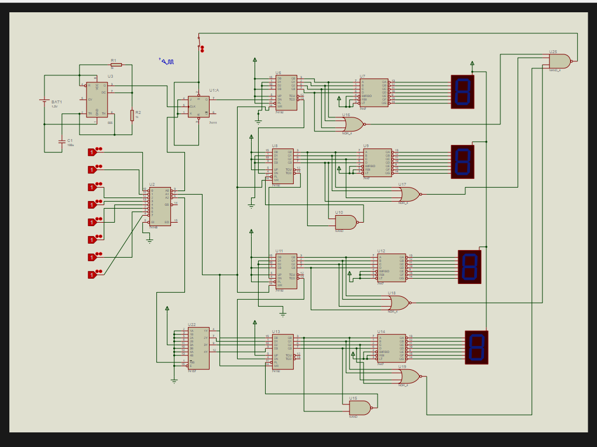
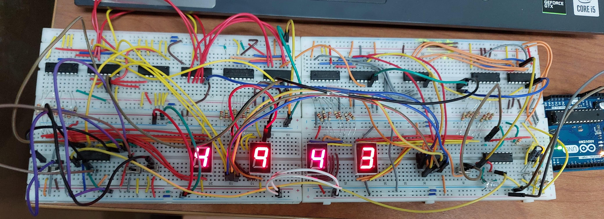
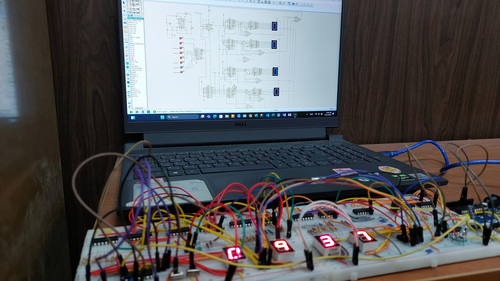

# ⏱️ FocusFlow: Digital Concentration Tracker

**FocusFlow** is a digital timer that boosts student productivity by alternating between 50-minute study sessions and 10-minute breaks. Built using digital logic components, it features automatic session switching and real-time countdown displayed via 7-segment displays.

> 📘 [View Full Report (PDF)](Full_Report.pdf)  
> 🖼️ [View Simulation Using Protos](Simulation.pdf)

---

## 📌 Overview

Designed as a digital electronics project, FocusFlow applies counters, flip-flops, timers, and logic gates to build a real-world, hardware-based productivity tool. It manages timed sessions, provides real-time feedback, and visually indicates mode status (study/break) using LEDs.

### Simulation Preview

The simulation, created using Python, demonstrates the circuit's functionality, showcasing the countdown and mode-switching logic in a virtual environment.

### Hardware Prototype
The working prototype was built on a breadboard, integrating all digital components to demonstrate real-world functionality. Below are two views of the hardware prototype:

  
  
  

---

## 🔧 Features

- 🔁 **Auto Mode Switching:** Between 50-min study and 10-min break  
- ⏱️ **Countdown Display:** 7-segment (MM:SS) with real-time tracking  
- 🎛️ **Manual Controls:** Mode selection switch + Reset button  

---

## 🔩 Key Components

- `555 Timer`: Generates base clock (2 Hz)  
- `JK Flip-Flop`: Toggles session modes  
- `BCD Counters`: Tracks time  
- `7-Segment Displays + Decoders`: Show time in MM:SS  
- `Multiplexer & Encoder`: Handle mode and input control  

---

## ⚙️ How It Works

1. **Start**: User selects session type (study/break) via switch  
2. **Preset Time** is loaded via multiplexer (49:59 or 09:59)  
3. **Countdown** driven by 1 Hz clock  
4. **Zero Detected**: Logic gates stop the timer at 00:00  
5. **Session Toggles**: Flip-flop prepares the next mode  
6. **Restart**: User presses reset to resume

---

## 🧠 Notable Challenges

| Problem | Solution |
|-------------|----------|
| High LED current | Added 220Ω resistors |
| Stable 1 Hz clock | Divided 2 Hz signal with JK flip-flop |
| Counter limit control | Used logic gates for reset at custom counts |
| Flip-flop instability | Fixed inputs to ensure toggle mode |
| Auto stop at 00:00 | NOR/NAND logic to cut clock pulse |

---

> Developed by **Alaa Khaled Taha** & **Amira ElSayed El-Demerdash**